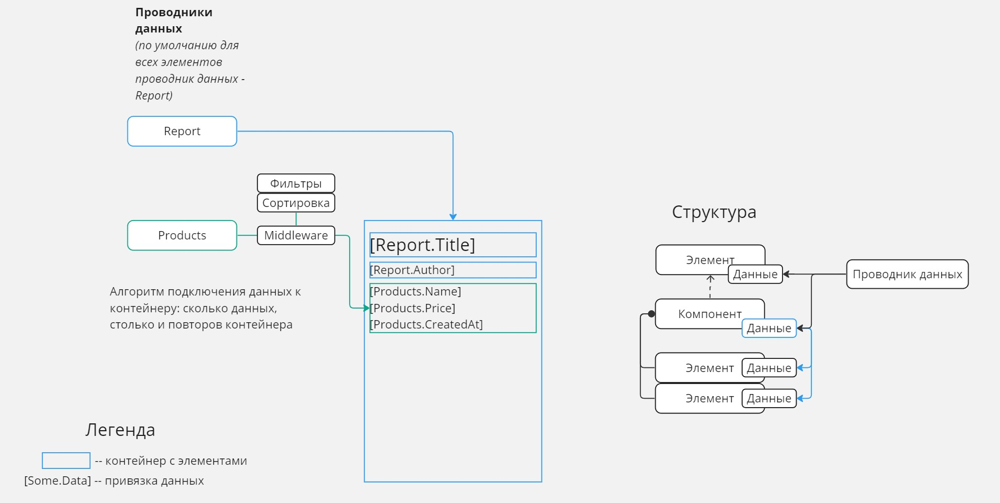
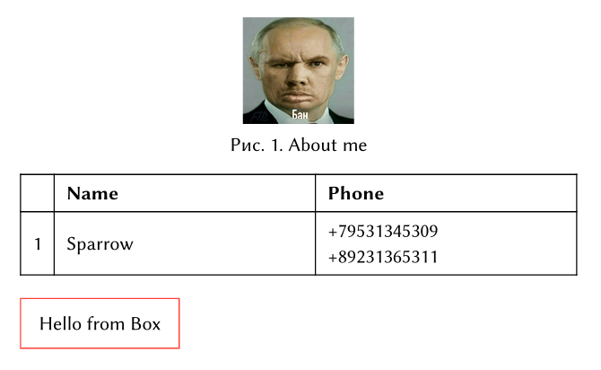

# Typstio
Откуда брать идеи: https://github.com/FastReports/FastReport/

### Внешний вид

Хочется, чтобы все было предельно визуально понятно и КРАСИВО (функционально). Можно посмотреть на `Miro` пример того, как это можно будет реализовать в `WPF` (со стрелочками, подсказками при вводе привязок данных и прочее). Но при этом **важно** сохранить простоту в коде.



### Отрисовка

Основную логику построения компонентов я реализую в `WPF`. Перечислю преварительный алгоритм отрисовки:

1. Создание по определенной структуре шаблонов в отчете.
2. Конвертация `WPF` компонентов в `Typst` реалии (`TextBlock` -> текст, `DataGrid` -> таблица и тд).
3. Бла бла бла


## ContentWriter

Sample 1 `C#`:

```C#
var document = new ContentWriter();
var image = new Image("profile.jpg", width: "20%");

document.Write(new Figure(image, "About me"));
document.WriteEmptyBlock();

document.Write(CreateUserTable());
document.WriteEmptyBlock();

document.Write(new Box(c => c.WriteString("Hello from Box"), new Rgb("#ff4136")));

Table CreateUserTable()
{
    var items = new Content[]
    {
        _ => { },
        c => c.Write(new Strong("Name")),
        c => c.Write(new Strong("Phone")),
        
        c => c.WriteString("1"),
        c => c.WriteString("Sparrow"),
        c => c.WriteString("+79531345309").Linebreak()
              .WriteString("+89231365311")
    };
    
    return new Table(("auto", "1fr", "1fr"), items, inset: "10pt", align: "horizon");
}
```

Sample 1 `Pdf`:


